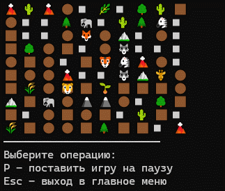

# **Проект “Симуляция”**

## Описание проекта
Суть проекта - пошаговая симуляция 2D мира, населённого травоядными и хищниками. Кроме существ, мир содержит ресурсы (траву), которыми питаются травоядные, и статичные объекты, с которыми нельзя взаимодействовать - они просто занимают место.
2D мир представляет из себя матрицу NxM, каждое существо или объект занимают клетку целиком, нахождение в клетке нескольких объектов/существ - недопустимо.

Подробное техническое задание доступно по ссылке:  
[ТЗ проекта](https://zhukovsd.github.io/java-backend-learning-course/projects/simulation/)

## Предварительные требования

*   Установите [.NET SDK 10.0](https://dotnet.microsoft.com/ru-ru/download/dotnet/10.0).
*   Убедитесь в успешной установке, выполнив в терминале команду: `dotnet --info`.

## Быстрый запуск (для разработки)

1.  Перейдите в корневую папку проекта (где находится файл `Simulation.csproj`).
2.  Выполните команду: `dotnet run`

## Сборка в исполняемый файл (для распространения)

1.  Выполните в корневой папке проекта команду:
    `dotnet publish -c Release -p:PublishSingleFile=true --runtime win-x64`
    *(Для других ОS укажите соответствующую runtime-идентификатор, например `linux-x64`)*.
2.  Перейдите в папку `bin/Release/net10.0/win-x64/publish`.
3.  Запустите файл `Simulation.exe`.

## Выходные файлы после сборки проекта:
1. `Simulation.exe` — основной файл для запуска проекта.
2. `Simulation.pdb` — файл для отладки проекта.

## Как работает симуляция
- Введите размеры карты.
- Наблюдайте за взаимодействием существ:
  - 🌿 **Трава** - ресурс для травоядных
  - 🦓 **Травоядные** - питаются травой
  - 🦁 **Хищники** - охотятся на травоядных
  - 🗻 **Камни** и 🌲 **Деревья** - статичные объекты
- Используйте предложенные операции для управления симуляцией:
  - `P` - поставить симуляцию на паузу
  - `Enter` - возобновить симуляцию
  - `Esc` - выйти в главное меню
